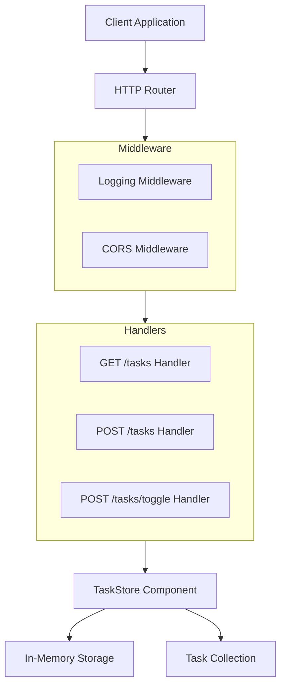

# Task API

A lightweight RESTful task management API written in Go that provides basic CRUD operations for tasks with built-in concurrency safety and middleware support.

## Architecture



## Key Features

- **RESTful API**: Clean HTTP endpoints for task management
- **Concurrency Safe**: Thread-safe operations using read/write mutexes
- **In-Memory Storage**: Simple map-based storage with automatic ID generation
- **Middleware Support**: Built-in logging and CORS middleware
- **JSON API**: Full JSON request/response support
- **Task Toggle**: Simple endpoint to mark tasks as done/undone

## Quick Start

### Prerequisites
- Go 1.22 or later

### Installation

1. Clone the repository:
```bash
git clone https://github.com/l-wuyan/test-repobrief.git
cd test-repobrief
```

2. Run the application:
```bash
go run main.go middleware.go
```

The API will start on `http://localhost:8090`.

## Usage Examples

### Create a Task
```bash
curl -X POST http://localhost:8090/tasks \
  -H "Content-Type: application/json" \
  -d '{"title": "Buy groceries"}'
```

Response:
```json
{
  "id": "task-1",
  "title": "Buy groceries",
  "done": false,
  "created_at": "2026-04-18T10:30:00Z"
}
```

### List All Tasks
```bash
curl http://localhost:8090/tasks
```

Response:
```json
[
  {
    "id": "task-1",
    "title": "Buy groceries",
    "done": false,
    "created_at": "2026-04-18T10:30:00Z"
  }
]
```

### Toggle Task Status
```bash
curl -X POST "http://localhost:8090/tasks/toggle?id=task-1"
```

Response:
```json
{
  "id": "task-1",
  "title": "Buy groceries",
  "done": true,
  "created_at": "2026-04-18T10:30:00Z"
}
```

## API Reference

### Endpoints

| Method | Endpoint | Description | Request Body | Query Parameters |
|--------|----------|-------------|--------------|------------------|
| GET | `/tasks` | List all tasks | None | None |
| POST | `/tasks` | Create a new task | `{"title": "string"}` | None |
| POST | `/tasks/toggle` | Toggle task completion status | None | `id` (task ID) |

### Task Object
```json
{
  "id": "string",
  "title": "string",
  "done": "boolean",
  "created_at": "datetime"
}
```

## Project Structure

```
test-repobrief/
├── main.go           # Main application with HTTP handlers and task store
├── middleware.go     # HTTP middleware (logging, CORS)
├── go.mod           # Go module definition
└── README.md        # This documentation
```

### Components

1. **TaskStore** (`main.go`):
   - Thread-safe in-memory storage for tasks
   - Automatic ID generation with sequence counter
   - Methods: `Add()`, `List()`, `Toggle()`

2. **HTTP Handlers** (`main.go`):
   - `/tasks` - GET (list) and POST (create)
   - `/tasks/toggle` - POST (toggle status)

3. **Middleware** (`middleware.go`):
   - `LoggingMiddleware`: Logs request details and duration
   - `CORSMiddleware`: Enables Cross-Origin Resource Sharing

## Configuration

The application uses default configuration:
- **Port**: `8090`
- **Storage**: In-memory (data lost on restart)
- **CORS**: Allows all origins (`*`)

To change the port, modify the `http.ListenAndServe` call in `main.go`.

## Development

### Building
```bash
go build -o task-api
```

### Running Tests
No test files are included in the current codebase. To add tests, create `*_test.go` files in the same directory.

### Adding New Features
1. Add new methods to `TaskStore` if needed
2. Create corresponding HTTP handlers
3. Update the router in `main()`
4. Consider adding middleware if appropriate

## Limitations

- **No persistence**: Tasks are stored in memory and lost on restart
- **No authentication**: API is open to all requests
- **No validation**: Minimal input validation on task creation
- **No pagination**: All tasks returned in a single list

## Contributing

This is a demonstration project. For contributions, please:
1. Fork the repository
2. Create a feature branch
3. Add tests for new functionality
4. Submit a pull request with a clear description

## License

No license file is included in the repository. Please contact the repository owner for licensing information.