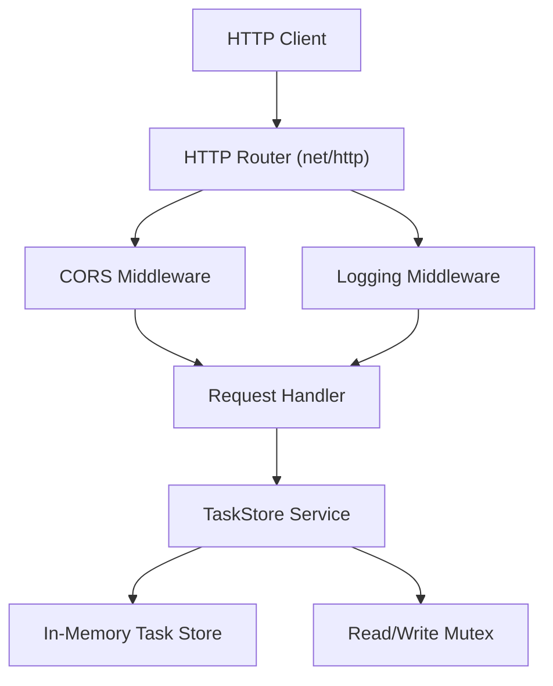

# Task API

A simple, in-memory task management API written in Go. Provides RESTful endpoints for creating, listing, and toggling tasks, with built-in logging and CORS support.

## Architecture

The application follows a layered HTTP server architecture with middleware.



## Key Features

*   **Task Management**: Create, list, and toggle the completion status of tasks.
*   **Thread-Safe Storage**: In-memory task store protected by a read-write mutex for concurrent access.
*   **HTTP API**: RESTful endpoints for all operations.
*   **Built-in Middleware**: Request logging and CORS headers.
*   **Health Check**: Simple `/health` endpoint for service monitoring.

## Quick Start

### Prerequisites
*   Go 1.22 or later

### Installation & Running

1.  Clone the repository and navigate to its directory.
    ```bash
    git clone <repository-url>
    cd test-repobrief
    ```
2.  Run the application.
    ```bash
    go run main.go middleware.go
    ```
3.  The server will start on port `8090`. You should see:
    ```
    Task API running on :8090
    ```

## Usage Examples

### Create a Task
```bash
curl -X POST http://localhost:8090/tasks \
  -H "Content-Type: application/json" \
  -d '{"title": "Buy groceries"}'
```
**Response:**
```json
{
  "id": "task-1",
  "title": "Buy groceries",
  "done": false,
  "created_at": "2026-04-19T10:30:00Z"
}
```

### List All Tasks
```bash
curl http://localhost:8090/tasks
```
**Response:**
```json
[
  {
    "id": "task-1",
    "title": "Buy groceries",
    "done": false,
    "created_at": "2026-04-19T10:30:00Z"
  }
]
```

### Toggle a Task's Completion Status
```bash
curl -X POST "http://localhost:8090/tasks/toggle?id=task-1"
```
**Response:** (Returns the updated task)
```json
{
  "id": "task-1",
  "title": "Buy groceries",
  "done": true,
  "created_at": "2026-04-19T10:30:00Z"
}
```

### Health Check
```bash
curl http://localhost:8090/health
```
**Response:**
```json
{"status": "ok"}
```

## Configuration

The application currently uses hardcoded configuration:
*   **Server Port**: `:8090`
*   **CORS Policy**: Allows all origins (`*`).
*   **Storage**: Volatile, in-memory only (data is lost on server restart).

To change the port, modify the `http.ListenAndServe` call in `main.go`.

## Project Structure

```
.
├── main.go              # Primary application entry point, HTTP handlers, and core logic.
├── middleware.go        # HTTP middleware functions (logging, CORS).
├── go.mod              # Go module definition.
└── README.md           # This documentation file.
```

**Core Components:**
*   `Task` struct: Data model for a task.
*   `TaskStore` struct: Thread-safe in-memory store for tasks.
*   `LoggingMiddleware`: Logs HTTP request method, path, and duration.
*   `CORSMiddleware`: Adds CORS headers and handles preflight requests.

## Contributing

This is a demonstration project. For contributions, please ensure:
1.  Code follows standard Go conventions.
2.  New features include appropriate tests.
3.  Pull requests include a clear description of changes.

## License

License information is not specified in the provided codebase. Please check the repository for a `LICENSE` file or refer to the project owner for licensing details.